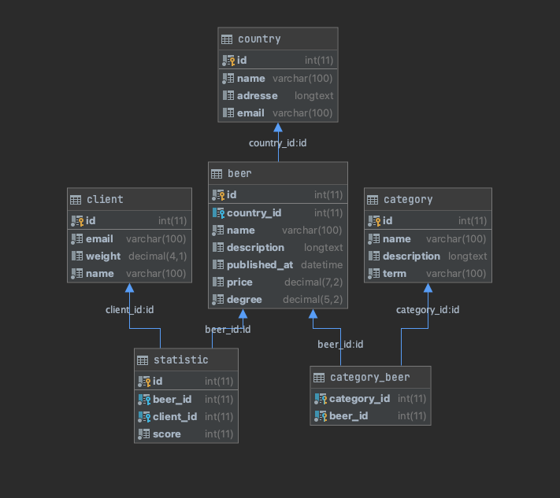

# Travaux pratique: Beer

## Membres du groupe
- ROUX Fiona
- BALDUCCI Victor
- TAN Amanda
- VINCELET Mathias
- DREIDEMY Romain

## Partie 3

### Shémas



### Justification
Dans la base de données, je n'ai pas ajouté la colonne "category_id" car nous avons déjà une jointure avec la table Beer qui à elle même une jointure avec la table Category.  

Pour moi ajouter cette colonne serait dupliquer une information.  

Aussi, la relation Beer et Category est ManyToMany, donc si on stock un "category_id" on ne pourras pas tous les avoirs.


## Partie 4
Voici un code Doctrine à écrire dans le Repository CategoryRepository, qu'en pensez vous ? Décrivez son utilité dans l'application si on devait le mettre en place.
```php
public function findCatSpecial(int $id)
{
    return $this->createQueryBuilder('c')
        ->join('c.beers', 'b') // raisonner en terme de relation
        ->where('b.id = :id')
        ->setParameter('id', $id)
        ->andWhere('c.term = :term')
        ->setParameter('term', 'special')
        ->getQuery()
        ->getResult()
    ;
}
```

Définition: Retourne la liste des catégories spécials pour une bière dont l'id est donné.

